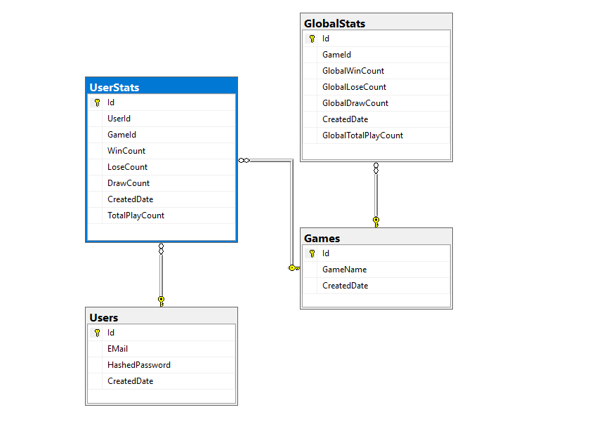
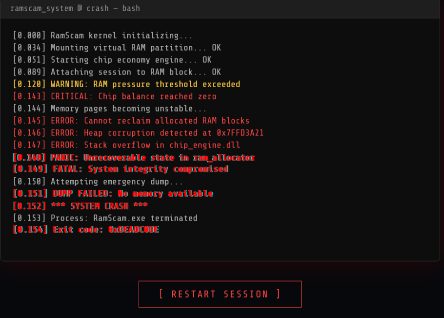
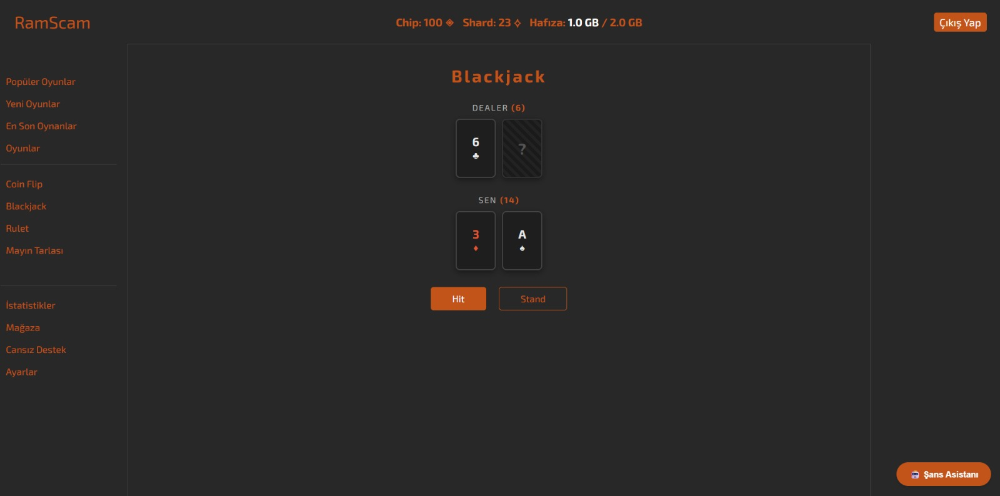
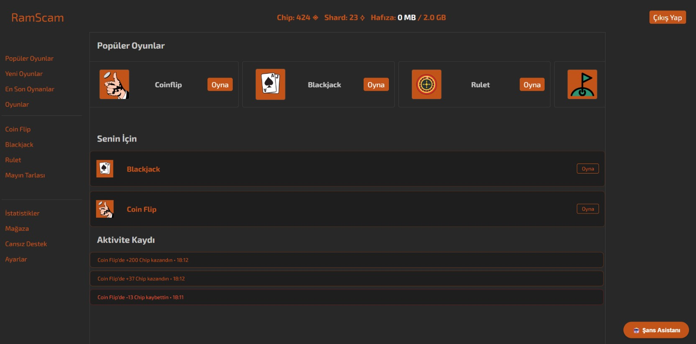

#  RamScam

RamScam, sıradan bir şans oyunu platformu olmanın çok ötesinde, kullanıcıların "gerçek donanım kaynaklarını" (RAM) risk ederek oynadığı, rogue-like mekaniklerine sahip, yapay zeka destekli benzersiz bir web uygulamasıdır. 

Kullanıcılar sisteme girdiklerinde risk etmek istedikleri RAM miktarını belirlerler. Projenin imza özelliği olan özel istemci taraflı (client-side) betikler sayesinde, oyun kaybedildikçe tarayıcı belleği kasıtlı ve kontrollü bir şekilde doldurulur. Sınır aşıldığında ise sistem sahte bir çökme ekranıyla "Run" (Tur) işlemini sonlandırır.

##  Teknolojiler ve Mimari

* **Backend:** C#, .NET 10, ASP.NET Core Minimal API
* **Veritabanı & ORM:** Microsoft SQL Server, Entity Framework Core (EF Core)
* **Güvenlik:** JWT (JSON Web Token) ile oturum yönetimi, BCrypt ile şifreleme
* **Frontend:** Vite, React, JavaScript, HTML, CSS
* **Otomasyon:** n8n,Azure

##  Oyun Mekanikleri

* **The "Run" (Tur) Sistemi:** Kullanıcının başlangıç çipi olarak yatırdığı RAM miktarından, tamamen batana kadar geçen sürece bir "Run" denir. Her tur **Seed** değeri ile oluşturulur.
* **Canlı RAM Tüketimi:** Tarayıcı tarafında çalışan özel bir algoritma, donanım RAM miktarını anlık olarak manipüle eder (Maks. 2GB). Kazanıldıkça bellek serbest bırakılır, kaybedildikçe şişirilir.
* **MMR ve Rogue-like:** Galibiyet oranına (Winrate) bağlı olarak dinamik bir MMR sistemi devrededir. Tur bitiminde MMR sıfırlanır.

##  Veritabanı Şeması

Projemizin ilişkisel veritabanı modeli aşağıdaki gibidir:


##  Kurulum ve Çalıştırma Adımları

Projeyi kendi ortamınızda (Localhost) test etmek için aşağıdaki adımları izleyin.

### 1. Backend & Veritabanı Kurulumu

Projeyi klonlayın sonrasında backend dizinine geçin ve veritabanını oluşturun:

```bash
git clone https://github.com/gerginkedi/RamScam.git
```
RamScam.csproj dosyasının bulunduğu klasörde sırasıyla komutları çalıştırın:
```bash
dotnet build
dotnet ef database update
```

* ⚠️**Önemli Not (Seed Data):** Database > dbo.Games'de ID = 1, ID = 2, ID = 3 Olarak 3 oyun manuel olarak eklenmeli aksi halde kayıt başarısız olacaktır 

Veritabanı hazırlandıktan sonra projeyi ayağa kaldırın:

```Bash
dotnet run
```

API varsayılan olarak https://localhost:xxxx portu üzerinde çalışmaya başlayacaktır.


### 2. Frontend Kurulumu

API arka planda çalışmaya devam ederken yeni bir terminal açın ve projenin ön yüz dizinine geçiş yapın:

```Bash
cd ../frontend
npm install
npm run dev
```

Vite sunucusu varsayılan olarak http://localhost:5173 adresinde çalışacaktır. Tarayıcınızdan bu adrese giderek projeyi görüntüleyebilirsiniz.

### 3. Docker kurulumu

```Bash
 docker-compose up --build
```

Ardından http://localhost:3000 adresinden erişilebilir

### 4. Dış Servisler (n8n Otomasyonu)

Projeye kayıt olan kullanıcılara "Hoş Geldin" e-postası göndermek ve arayüzde rastgele ilginç bilgiler (Fun Fact) sunmak için n8n iş akışı otomasyonu kullanılmaktadır.

* **Hızlı Test İçin (Önerilen):** Geliştirme sürecinde n8n altyapısı ekibimiz tarafından bir bulut sunucusunda (Azure) aktif olarak host edilmektedir. Herhangi bir ekstra kurulum yapmadan projeyi anında test edebilirsiniz.

* **Yerel Kurulum (Opsiyonel):** Projeyi tamamen kendi izole ortamınızda çalıştırmak isterseniz, Docker üzerinden kendi n8n konteynerinizi ayağa kaldırabilir ve appsettings.json içerisindeki Webhook URL'lerini kendi local adresiniz (localhost:5678) ile güncelleyebilirsiniz.

### Uygulama Görselleri




👨‍💻 Geliştirici Ekip
Bu proje Sinop Üniversitesi Bilgisayar Mühendisliği öğrencileri tarafından geliştirilmiştir:

* **Ömer**
* **Erdem**
* **Süleyman**
