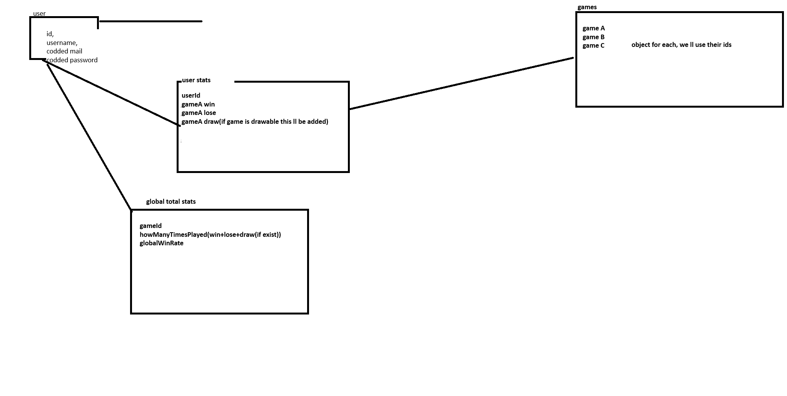

#RamScam

run -kullanicnin cip almak icin ram girdigi andan batana kadar olan araya bir run denir-

kullanici sisteme mail ve sifresi ile girer.
sifre codded sekilde tutulcak, belki mail de codded sekilde tutulur.
kullanici sisteme girdiginde kullanicidan total raminin girilmesi istenicek. daha sonra bu oyun icin kullanmak istedigi rami giricek.
kullanicniin cip olarak kullanacagi ram miktarini aninda js scripti ile bosa doldurucak program. bu sekilde kullanicnin hile yapip yapmadigini ogrenicek program
ana menude oynanabilecek olan oyunlari gorucek. bunlardan herhangi birine girdigi zaman kisaca oyun anlatilip, daha sonrasinda oyuna gecilecek.
kullanici hesabini ilk actiginda 0 olan oyun statlari oynadigi oyuna gore articak, 10 tane coin flip oynadiysa cf columni 10 olcak gibi gibi
ayrica kullanicinin winrate i de tutulacak her oyun icin. ornegin 20 el blackjack oynamis, 12 tanesini kazanmis 12/20(win/oynanan oyun sayisi) 
yaptigimizda winratei ortaya cikar.
oyunlardan kazanacagi para ise sabit olmayacak. winratei ne kadar yuksekse o kadar cok kazanicak buna gore bir algoritma gelistirilecek.
	loldeki mmr sistemine benzetilebilir, bu mmr olayi oyuncu battiginda sifirlanacak(runin sonunda). her oyunun mmr i etkileme sekli farkli olacak.
kullanici kazandigi paralari ise ozel yetenekleri olan esyalar satin alarak harcayacak. bu da kullaniciya rogue like bir deneyim kazandirip oyunda tutacak.

randomlugu, oyununun esnekligini ve eglenceyi arttirmak icin her bir runin seedi olacak.

ozet olarak databasede tutulacak degerler, global degerler:
	mail,
	password,
	ornegin a b c oyunlari olsun
		giren insanlarin a oyununu kac kere oynadigi,
		a oyununda kac defa kazandiklari,
		a oyununda kac defa kaybettikleri,
		a oyununda varsa kac defa 0 kazanc ile ciktiklari(berabere denebilir)
		b ve c oyunlari icin de bunlar tutulacak.
		
		

	her run icin database e gonderilecek degerler:
	a oyununa giris yaptigi anda oyuncunun stati 1 articak. 
	(a oyunun tum kullanicilar tarafindan kac defa oynandigi istatistiginin butun kullanicilarin a oyununu oynama sayilarini toplayara elde edicez)
	b ve c oyunlari icin de bunlar yapilacak.
	kazanirsa databasedeki a oyununu k kullanicisinin kazanma sayisi 1 articak
	ayni sekilde kayip ve 0 kazanc durumlarinda da bunlar uygulanacak.
	
	oyunla alakali surekli degisip, surekli artacak seyler sitenin mobilligi acisindan browser tarafli tutulacak bu sekilde frontendci amini karislamicak
		

